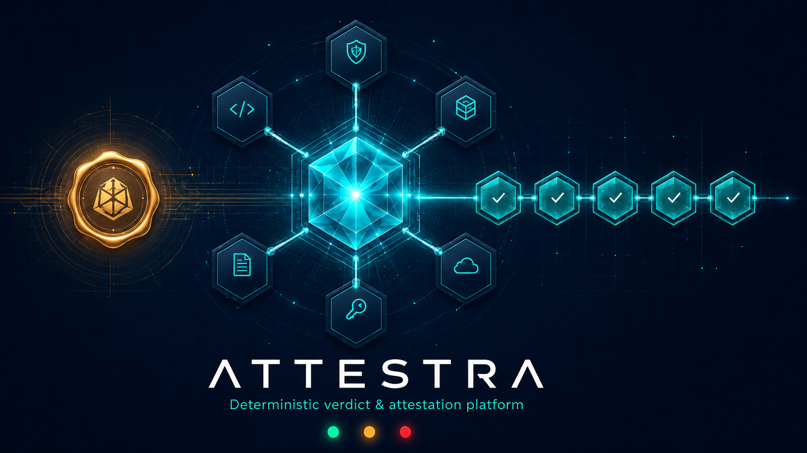

[](https://github.com/sadpig70/Attestra/actions/workflows/ci.yml)

# Attestra

> **위임된 자율 행위에 대해 authority·custody·route·rollback·trace 증거를 검증하고,
> 구속력 있는 verdict(`valid`/`thin`/`breach`)를 hash-chain으로 발행하는 결정론 attestation 플랫폼.**

Attestra는 **하나의 결정론 verdict 커널 + N개 도메인 팩** 구조다. AI 에이전트가 점점 더 많은
위임 권한을 갖게 되면서, "위임된 행위가 올바른 권위에 제대로 반환됐는가"를 사후에 **결정론적으로**
증명하는 게이트가 필요해졌다. corpus의 수많은 거버넌스·신뢰 프로젝트가 도메인만 바꿔 같은 검증
기계를 반복 구현해 왔는데, Attestra는 그 기계를 커널로 한 번만 정의하고 각 프로젝트를 **팩**으로 얹는다.

## 계보
> 🔗 **생태계 데모**: [stra-demo](https://github.com/sadpig70/stra-demo) — route → clear → certify → attest가 한 결정을 함께 처리하는 end-to-end 데모.


Attestra는 [HELIX](../README.md)의 자식 프로젝트다 — 단, **독립 저장소**로 이 폴더만으로 자립 구동한다.

- **HELIX** = 프로젝트를 *생성*하는 자율 창조 폐루프 (explore ⊕ exploit).
- **Attestra** = HELIX corpus의 거버넌스·신뢰 군집(~30개)을 *운영*하는 런타임 플랫폼.
  각 프로젝트(ActionHandbackVerifier·SpendBoundary·VetoEscrow·DelegationUnderwriter…)는
  `predicate(packet, P) -> CheckResult` 계약을 따르는 **팩**으로 적재된다 (복사가 아니라 계약 연합).

## 왜 플랫폼인가 (한 줄)

corpus의 각 프로젝트는 "compact 증거 패킷 → 독립 predicate 게이트 → `valid/thin/breach` → hash-chain
감사 원장"이라는 **동일 substrate**를 중복 구축했다. Attestra는 그 중복을 커널에 한 번만 정의해
desync를 제거하고(single source of truth), 팩은 predicate와 패킷 스키마 확장만 기여한다.

## 구조

```
Attestra/
├── README.md
├── .pgf/                          # PGF 설계·계획·상태 (pgf full-cycle로 지어짐)
│   ├── DESIGN-Attestra.md         #   메인 설계 (Gantree + PPR)
│   ├── DESIGN-AttestraPacks.md    #   (decomposed) 1차 팩 10종 명세
│   ├── WORKPLAN-Attestra.md       #   실행 계획 (POLICY + 위상정렬 + 검증 게이트)
│   └── status-Attestra.json       #   노드별 상태
├── .pgxf/                         # PGXF 인덱스 (>30 노드 · decomposed 크로스ref)
│   └── INDEX-Attestra.json
├── attestra_core/                 # ★ 커널 — 단일 출처 결정론 verdict substrate (stdlib only)│   ├── packet.py                  #   증거 패킷 모델 + private-payload 거부
│   ├── verdict.py                 #   valid/thin/breach severity 대수
│   ├── gate_runtime.py            #   predicate 실행 + verdict 집계
│   ├── ledger.py                  #   hash-chain append-only 감사 원장
│   ├── fingerprint.py             #   정체성 primitive (HELIX-Core 승격)
│   ├── provenance.py              #   계보 추적 + attestation trace
│   └── attestation.py             #   valid verdict → 발행 가능한 warrant
├── attestra_packs/                # ★ 도메인 팩 — 각 HELIX 프로젝트의 predicate 계약│   └── handback/                  #   레퍼런스 팩 (ActionHandbackVerifier parity)
├── schemas/                       # JSON Schema (packet/verdict/ledger/attestation/manifest)├── cli.py                         # sample/run/verify/report/attest/pack/ledger└── tests/                         # 결정론 unittest (커널 + 팩 parity + 파이프라인)```

> 현재 상태: **구현·검증 완료**. 커널 + 16 팩 전부 구현, 결정론 unittest + parity + determinism boundary 통과, CI green.

## 핵심 개념

| 개념 | 설명 |
|---|---|
| **Packet** | 공개 증거 digest만 담는 패킷. `payload`/`secret` 등 사적 필드는 거부. |
| **Predicate** | 팩이 제공하는 순수 함수 `predicate(packet, P) -> CheckResult`. 시계·네트워크·AI 없음. |
| **Verdict** | `valid < thin < breach` severity 대수. 집계 = 최고 severity. |
| **Ledger** | 정규 JSON(sort_keys, no timestamp) 기반 hash-chain append-only 원장. 변조 탐지. |
| **Attestation** | breach가 아니면 발행되는 warrant. `valid`=full, `thin`=conditional. breach=발행 거부. |
| **Pack** | HELIX 프로젝트 한 개 = predicate 집합 + 패킷 스키마. 커널 로직 재정의 없음. |
| **Pipeline** | 여러 팩을 한 패킷에 합성 (SpendBoundary 수동 재조합을 1급 기능으로 일반화). |

## 1차 도메인 팩 (10종)

`handback`(레퍼런스) · `spend-boundary` · `veto-escrow` · `delegation` · `withheld-action` ·
`policy-drift` · `custody-relay` · `slot-gate` · `context-boundary` · `action-governance`.

**추가 흡수 팩 (총 16종):** `repro-dossier` · `gen-cert` · `reserve-flow`(clearing 검증) ·
`sov-mesh` · `pqc-mesh` · `signal-mesh`. 뒤 3종은 "Compatibility Mesh" 클러스터를 **machine-aware
routing**으로 흡수한 것 — 이름은 같아도 machine을 실코드로 판정해, verdict 게이트인 SovMesh/PqcMesh/
SignalMesh만 Attestra로 들어오고 FlowMesh(→Routestra bound)·AgentMesh(→Clearstra price)는 다른
플랫폼으로 라우팅됐다. 각 mesh 팩은 원본과의 parity 테스트를 동봉한다(`tests/test_*_mesh_parity.py`).

각 팩은 `source_project`로 원본 저장소(github.com/sadpig70/*)를 추적한다.

## 결정론 경계

- **커널 + 팩 predicate = 순수 결정론**: stdlib only, 시계·네트워크·AI 없음. 시간은 주입(`now`),
  의미 유사도는 주입(`sim`). hash 입력에서 `now`/`*_at` 메타는 제외 → 시간 무관 재현.
- **팩 내부 LLM/휴리스틱 = 메타층** — Attestra 경계 밖 (원본 프로젝트 소관).

## 빠른 시작

```bash
# 팩 레지스트리 (16 팩)
python cli.py pack list

# 팩 샘플 패킷 생성 → verdict → 원장 append → 체인 검증
#   sample은 팩명 prefix로 파일을 쓴다: examples/handback.{valid,thin,breach}.json
python cli.py sample --pack handback --out examples
python cli.py run --pack handback --input examples/handback.valid.json --ledger examples/ledger.jsonl
#   -> {"subject": "HB-VALID-001", "verdict": "valid", ...}
python cli.py attest --pack handback --input examples/handback.valid.json   # warrant 발행 (grade=full)
python cli.py verify --ledger examples/ledger.jsonl          # 체인 무결성 -> {"valid": true, "records": 1}

# ★ 닫힌 감사 루프: 디렉토리의 모든 패킷을 일괄 처리 → 단일 감사 원장 + attestation + 요약
python cli.py audit --dir examples --report examples/audit.md
#   각 패킷을 팩으로 자동 라우팅(packet["pack"] 또는 파일명 prefix) → verdict → 비-breach는 warrant 발행
#   → 전부를 하나의 hash-chain 원장에 append → 체인 검증. 종료코드: 0=전부통과 / 1=breach존재 / 2=운영실패

# 결정론 경계 검사
python cli.py determinism                                    # -> {"clean": true, ...}
```

## 문서

- 아키텍처: [`docs/ARCHITECTURE.md`](docs/ARCHITECTURE.md) — 커널·팩·경계·3클러스터 매핑
- 팩 작성 규격: [`docs/PACK-CONTRACT.md`](docs/PACK-CONTRACT.md) — 외부 팩 작성법(예제 포함, 커널 무수정)
- 결정론 경계: [`docs/DETERMINISM.md`](docs/DETERMINISM.md) — 재현성 계약 + 검사기

## 설계 문서

- 메인 설계: [`.pgf/DESIGN-Attestra.md`](.pgf/DESIGN-Attestra.md) (Gantree + PPR 계약)
- 팩 명세: [`.pgf/DESIGN-AttestraPacks.md`](.pgf/DESIGN-AttestraPacks.md)
- 실행 계획: [`.pgf/WORKPLAN-Attestra.md`](.pgf/WORKPLAN-Attestra.md)
- 구조 인덱스: [`.pgxf/INDEX-Attestra.json`](.pgxf/INDEX-Attestra.json)

## 라이선스

MIT License © 2026 sadpig70 (Jung Wook Yang)
